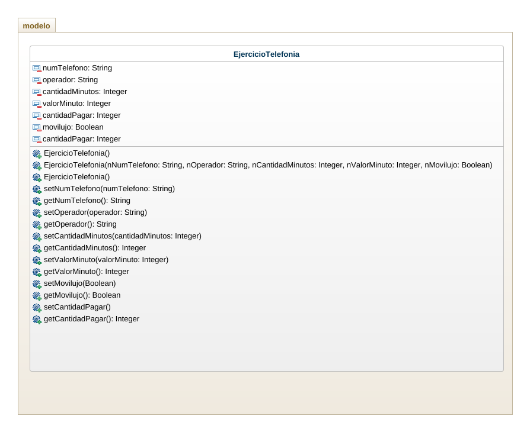

## Ejercicio 
Crear un programa para gestionar un plan de telefonía celular el plan tiene un número de celular, un operador, una cantidad de minutos y un costo por minutos calcular el total a pagar teniendo en cuenta que si el operador es movilujo tiene un 50% de descuento. Usar mínimo tres constructores.

## Analisis

Plan numero celular

digitar Numero celular
preguntar Operador del celular
determinar Cantidad de minutos usados
mirar si es usuario movilujo
decir valor por minuto

con el valor por minuto multiplicarlo por la cantidad de minutos para saber el precio a pagar

si el usuario el movilujo, entonces se le descuenta el 50% a su total a pagar

